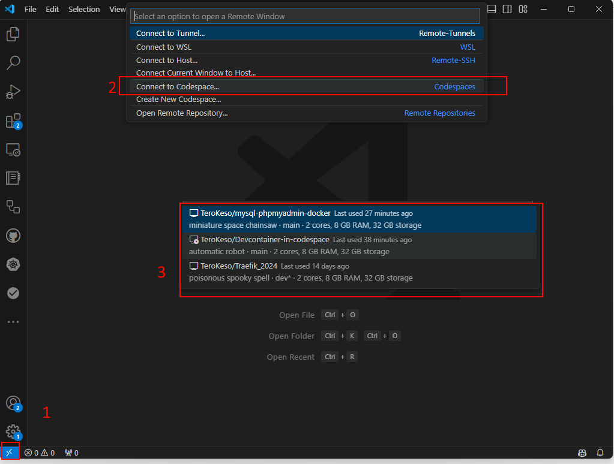

# Devcontainers Goals

Goal is to get a working devcontainer with semi persistent dns name and settings. Also integrate Tailscale for easy access to the devcontainer. If it is possible to get all working with Vscode web version.

## Connect to from local Vscode to Codespace

## Tailscale manual user auth 1/2

Just add 

(https://github.com/tailscale/codespace)[https://github.com/tailscale/codespace]
    
    "runArgs": ["--device=/dev/net/tun"],
    "features": {
      "ghcr.io/tailscale/codespace/tailscale": {
        "version": "latest"
      }
    }

and the run 'sudo tailscale up' in the terminal. It will ask you to authenticate and you are good to go.

## Tailscale key automatic auth 2/2

.devcontainer has build in auth key place and you need to add auth key to github secrets.

Materials
* https://tailscale.com/kb/1017/install
* https://www.youtube.com/watch?v=e-X5FJwrkaA

## Docker non root / Vscode docker management broken

Material
* https://code.visualstudio.com/remote/advancedcontainers/add-nonroot-user
* https://github.com/microsoft/vscode-dev-containers/blob/main/containers/docker-in-docker/README.md

## Docker works by default if you add a docker file to the root of the project.
- Still not getting docker management to work.